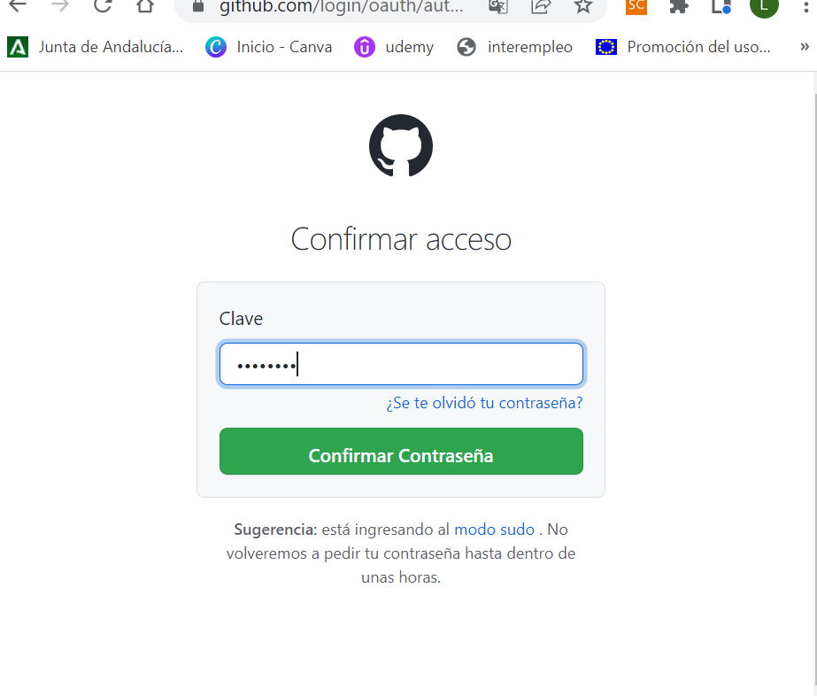
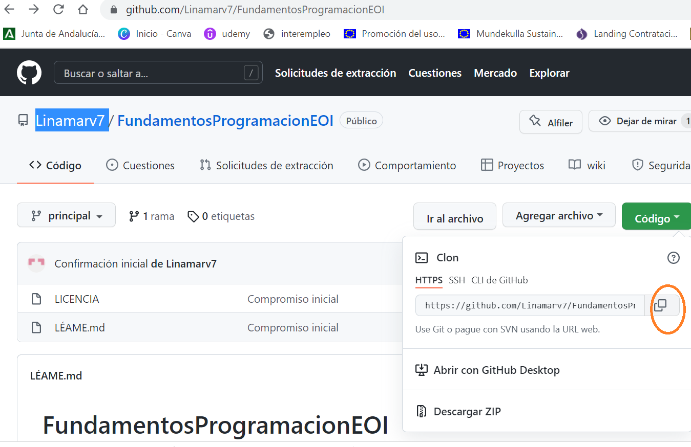
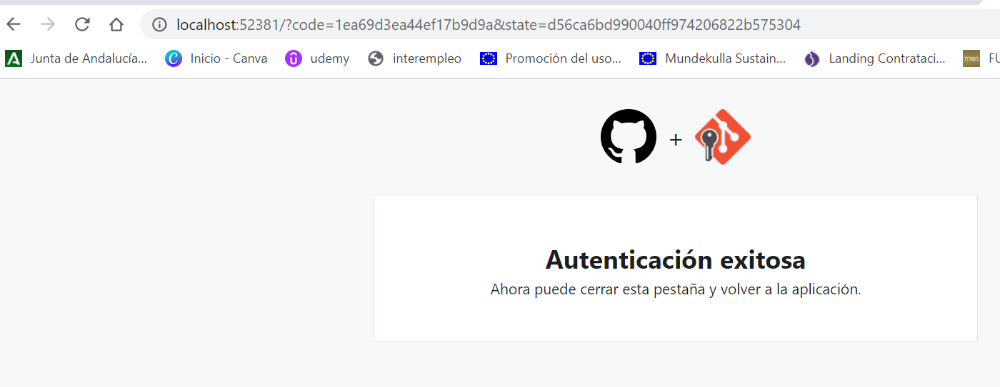

 - Explorar Git  

1. ​      Descargar e instalar el git (CONSEGUIDO)

​			  https://git-scm.com/download/win

2. Usar el git creando un repositorio local por primera vez **(SOLO LA PRIMERA VEZ)**

   CONFIGURACION INICIAL 

   2.1 Crear una carpeta de trabajo

```
c:> cd -- Cambia de carpeta, md -- crea carpeta, rd -- borra carpeta
    cls -- limpiar la ventana de command prompt
    
c:>MD 00-EOI
C:>CD 00-EOI
```

​      2.2 Comprobar que el GIT esta instalado 

```
c:>git
```

​     2.3 Crear un repositorio local

```
c:> git init 
Initialized empty Git repository in C:/00-EOI/.git/
```

​    2.4 Revisar la configuración global al ordenador de GIT (La respuesta es que no tiene configuración global)

```
c:>git config --global -l
fatal: unable to read config file 'C:/Users/WDAGUtilityAccount/.gitconfig': No such file or directory
```

​    2.5 Establecemos el usuario y el correo electrónico

```
c:>git config --global user.name "BillyClassTime"
```

```
c:>git config --global user.email="billy@billyclasstime.com" 
```

2.6 Comprobar la configuración global previamente establecida

```
c:>git config --global -l
user.name=BillyClassTime
user.email=billy@billyclasstime.com
```

3. Establecer una conexión entre mi repositorio local y el repositorio remoto (GITHUB)

 ```
C:>git branch
<no muestra nada>
 ```


```
c:> git status
On branch master

No commits yet

Untracked files:
  (use "git add <file>..." to include in what will be committed)
        FICHEROMDVSCODE.md
        img/
```

Añadir nuestros ficheros al seguimiento

```
c:> git add .
```

Volvemos a pedir el status

```
c:> git status
On branch master
No commits yet
Changes to be committed:
  (use "git rm --cached <file>..." to unstage)
        new file:   FICHEROMDVSCODE.md
        new file:   img/00.png
        new file:   img/01.png
```

Confirmar nuestros cambios en local:

```
c:> git commit -m "Estableciendo los primeras pasos"
[master (root-commit) 5822109] Estableciendo los primeros pasos
 3 files changed, 196 insertions(+)
 create mode 100644 FICHEROMDVSCODE.md
 create mode 100644 img/00.png
 create mode 100644 img/01.png
```

Pedir el status por penultima vez

```
C:\00-EOI>git status
On branch master
nothing to commit, working tree clean
```

Enlazamos el repositorio local con el remoto

```
IR AL GITHUB -> COPIAR la ruta del repositorio de git
```



Establecemos la conexion

```
git remote add main https://github.com/BillyClassTime/FundamentosProgramacionEOI.git
```

NOTA:

Borrar la conexión al repositorio remto si es necesario:

```
git remote rm main
```

Consultar que repositorios remotos estan enlazados a nuestro repositorio local

```
git remote -v
```

Actualizamos el repositorio remoto (GitHub)

```
git push main
```


### CONFIRMACION DE NUESTRO USUARIO DE GITHUB



Finalización de la autorización




 
BUCLE

1 - Hacer las actualizaciones en los ficheros, imagenes, programas, carpetas y demás elementos de nuestro proyecto.

2 - Informar a git de los cambios:

```
c:><caperta del proyecto> git add .
```

3 - Actualizar nuestro repositorio LOCAL o Confirmación de los cambios.

```
c:><caperta del proyecto> git commit -m "<TEXTO CON LA OBSERVACION DE LA CONFIRMACION"
```

4 - Actualizamos al remoto (NO LO VEREMOS EN GITHUB)

```
c:><caperta del proyecto> git push main
```

5 - Revisar el status

```
c:><caperta del proyecto>git status
```


Vuelta al No. 1


